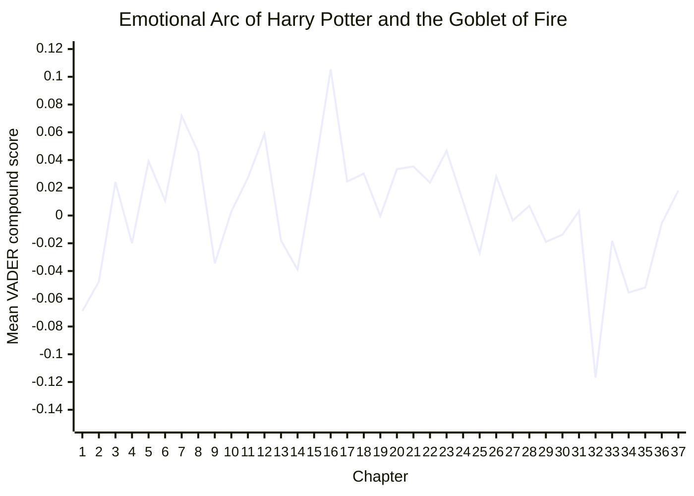

# Emotional Arc Analysis with VADER

An NLP project that maps the emotional trajectory of *Harry Potter and the Goblet of Fire*
using sentence-level VADER sentiment analysis. The complete implementation and saved visual
results are contained in [`Project.ipynb`](Project.ipynb).

## Project results

| Metric | Result |
|---|---:|
| Chapters extracted | **37 / 37 (100%)** |
| Sentences analyzed | **18,112** |
| Rolling sentiment window | **25 sentences** |
| Characters analyzed | **4** |
| Strongest positive passages exported | **20** |
| Strongest negative passages exported | **20** |
| Saved analytical charts | **5** |
| Most positive chapter average | **0.1054 - Chapter 16** |
| Most negative chapter average | **-0.1169 - Chapter 32** |

## Emotional arc across 37 chapters



Each point is the mean of the sentence-level VADER scores in that chapter. Positive values
indicate a more positive average tone, while negative values indicate a darker average tone.
The curve reaches its highest point in **Chapter 16, The Goblet of Fire**, and its sharpest
negative drop in **Chapter 32, Flesh, Blood, and Bone**. Chapters 34 and 35 remain relatively
negative before the sentiment recovers toward neutral in the final two chapters.

The notebook contains a higher-resolution version with an interquartile band showing the middle
50% of sentence scores in every chapter.

## What the project does

### Chapter extraction

The parser recognizes uppercase and hyphenated chapter numbers such as `TWENTY-ONE`. It asserts
that all 37 chapters are present before analysis, preventing later chapters from being silently
merged into larger sections.

### Sentence-level VADER sentiment

The novel is divided into 18,112 sentences. VADER is applied to the original sentences rather
than heavily cleaned text, preserving punctuation, capitalization, intensifiers, and negation.

Each sentence receives:

- Positive, neutral, and negative proportions
- A compound sentiment score from `-1` to `+1`
- A positive, neutral, or negative label
- A 25-sentence rolling sentiment value

### Chapter-level emotional arc

Sentence scores are aggregated into:

- Mean and median chapter sentiment
- Lower and upper quartiles
- Positive, neutral, and negative sentence shares
- Minimum and maximum sentiment
- Emotional volatility

The most positive average occurs in **Chapter 16, The Goblet of Fire (`0.1054`)**. The darkest
average occurs in **Chapter 32, Flesh, Blood, and Bone (`-0.1169`)**, corresponding to the
novel's graveyard sequence.

### Character-context sentiment

The notebook analyzes sentiment surrounding mentions of:

- Harry
- Ron
- Hermione
- Voldemort

Aliases such as `Harry Potter`, `Ronald`, `Lord Voldemort`, `You-Know-Who`, and `the Dark Lord`
are supported. One neighboring sentence on either side of each mention is included to preserve
narrative context. Missing character appearances are represented separately from neutral text.

### Intense-passage extraction

The 20 strongest positive and 20 strongest negative sentences are exported for manual review.
This connects aggregate sentiment measurements back to concrete passages from the story.

## Visualizations

The notebook contains five saved, GitHub-viewable charts:

1. Chapter-level emotional arc with an interquartile band
2. Continuous 25-sentence rolling sentiment
3. Positive, neutral, and negative sentence shares by chapter
4. Emotional volatility by chapter
5. Character-by-chapter sentiment heatmap with mention counts

## Methodology

```text
Novel text
   |
   v
Validate and extract 37 chapters
   |
   v
Split chapters into 18,112 sentences
   |
   v
Score original sentences with VADER
   |
   +--> Calculate chapter statistics
   +--> Generate the rolling emotional arc
   +--> Analyze character context
   +--> Extract emotionally intense passages
   |
   v
Create tables and visualizations
```

## Repository structure

```text
.
|-- Project.ipynb
|-- Harry Potter And The Goblet Of Fire.txt
`-- README.md
```

- `Project.ipynb`: self-contained implementation, analysis, and saved visualizations.
- `Harry Potter And The Goblet Of Fire.txt`: source text analyzed by the notebook.
- `README.md`: project methodology, results, and execution instructions.

## Running the project

1. Clone or download the repository.
2. Open `Project.ipynb` from the repository root.
3. Install the dependencies if required:

```python
%pip install pandas numpy nltk matplotlib seaborn
```

4. Run the notebook cells in order.

The notebook downloads the small VADER lexicon if it is unavailable. Execution creates a local
`outputs/` directory containing CSV results and chart images. These files do not need to be
committed because the main charts are already saved inside the notebook.

## Resume-ready summary

> Built a self-contained NLP pipeline using VADER to analyze 18,112 sentences across all 37
> chapters of a novel, generating rolling emotional arcs, chapter-level sentiment distributions,
> emotional-volatility measures, character-context analysis, and five analytical visualizations.

## Limitations

- VADER is a lexicon-based model and is not trained specifically on literary fiction.
- Character analysis detects explicit aliases but does not perform full pronoun coreference.
- Chapter averages summarize many mixed emotions and should be interpreted alongside sentence
  distributions and rolling sentiment.
- Model accuracy and F1 are not reported because the project does not currently include a
  human-labeled validation dataset.
