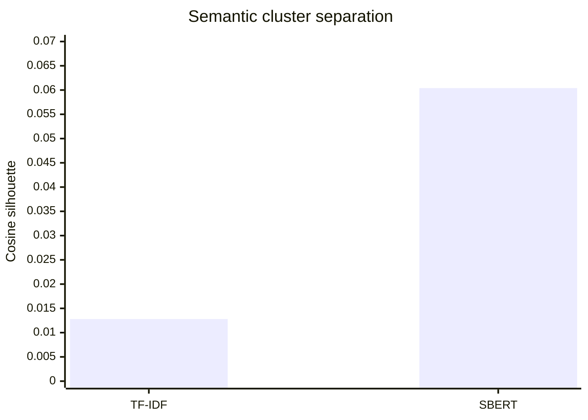
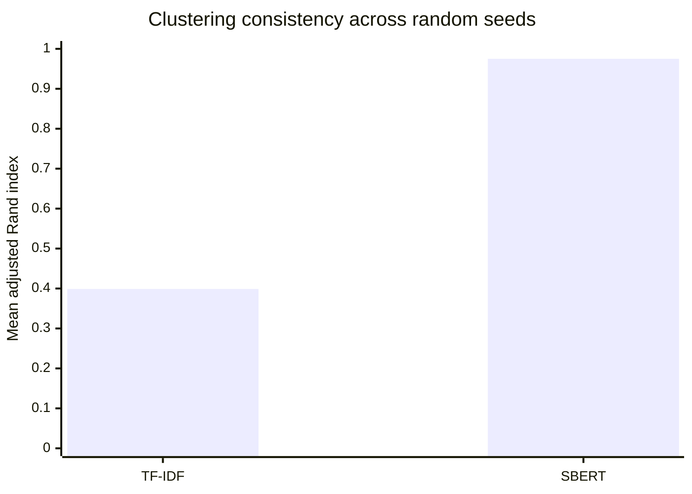

# Emotional Arc Analysis of a Harry Potter Novel

An end-to-end natural language processing project that maps the emotional trajectory of
*Harry Potter and the Goblet of Fire*. The analysis combines sentence-level sentiment,
chapter aggregation, character context, lexical features, and semantic embeddings to examine
how tone and subject matter change throughout the story.

The complete implementation and saved visual results are contained in
[`Project.ipynb`](Project.ipynb).

## Headline results

| Metric | Result |
|---|---:|
| Chapters extracted | **37 / 37 (100%)** |
| Sentences analyzed | **18,112** |
| Semantic passages benchmarked | **1,811** |
| Best TF-IDF silhouette | **0.0128** at 7 clusters |
| Best SBERT silhouette | **0.0604** at 2 clusters |
| SBERT silhouette gain | **4.71x** (`+371.06%`) |
| TF-IDF cluster stability | **0.399 ARI** |
| SBERT cluster stability | **0.975 ARI** |
| TF-IDF feature dimensions | **6,946** |
| SBERT embedding dimensions | **384** |
| Embedding dimensionality reduction | **94.5%** |

SBERT produced a substantially stronger clustering result than TF-IDF. Because the TF-IDF
silhouette score is close to zero, the raw scores and `4.71x` multiplier are more informative
than the percentage gain by itself.

## TF-IDF vs SBERT comparison

### Best cosine silhouette score



Silhouette score measures how well each passage fits its assigned cluster relative to other
clusters. Higher is better. Both absolute values indicate that the novel contains overlapping
themes, but SBERT separates those themes much more effectively.

### Five-seed cluster stability



Adjusted Rand index measures agreement between cluster assignments across five K-Means seeds.
SBERT's `0.975` score indicates that its cluster structure is highly reproducible, whereas the
TF-IDF result is considerably more sensitive to initialization.

## Methodology

### 1. Chapter extraction

The parser recognizes uppercase and hyphenated chapter numbers such as `TWENTY-ONE`. It asserts
that all 37 chapters are present before analysis, preventing later chapters from being silently
merged into larger sections.

### 2. Sentence-level sentiment

The text is split into 18,112 sentences. VADER is applied to the original sentences rather than
heavily cleaned text, preserving punctuation, capitalization, intensifiers, and negation.

Sentence scores are aggregated into:

- Mean and median chapter sentiment
- Lower and upper quartiles
- Positive, neutral, and negative sentence shares
- Minimum and maximum sentiment
- Emotional volatility
- A continuous 25-sentence rolling emotional arc

The most positive chapter average is **Chapter 16, The Goblet of Fire (`0.1054`)**. The darkest
chapter average is **Chapter 32, Flesh, Blood, and Bone (`-0.1169`)**, which aligns with the
novel's graveyard sequence.

### 3. Character-context analysis

The notebook examines sentiment surrounding mentions of:

- Harry
- Ron
- Hermione
- Voldemort

Aliases such as `Harry Potter`, `Ronald`, `Lord Voldemort`, `You-Know-Who`, and `the Dark Lord`
are supported. One neighboring sentence on either side of a mention is included to retain more
context than name-only line matching.

### 4. Lexical analysis

TF-IDF unigrams and bigrams identify terms that distinguish positive and negative chapters.
Custom stop words remove frequent narration terms and central character names where appropriate.
The notebook also exports the 20 strongest positive and 20 strongest negative passages for
manual inspection.

### 5. TF-IDF and SBERT benchmark

The novel is divided into 1,811 non-overlapping passages of approximately 10 sentences. Passage
boundaries never cross chapters. Both representations are evaluated using the same clustering
workflow:

1. Generate TF-IDF features using unigrams and bigrams.
2. Generate normalized 384-dimensional embeddings with
   `sentence-transformers/all-MiniLM-L6-v2`.
3. Fit K-Means for every cluster count from 2 through 8.
4. Use `n_init=10` and a fixed comparison seed of 42.
5. Calculate cosine silhouette scores for cluster separation.
6. Repeat clustering across five seeds and calculate mean pairwise adjusted Rand index.

The reported comparison uses the best silhouette obtained by each representation over the same
tested cluster-count range. The complete score curve and executable benchmark are saved in the
notebook.

## Visualizations included in the notebook

The notebook contains seven saved, GitHub-viewable charts:

1. Chapter-level emotional arc with an interquartile band
2. Continuous 25-sentence rolling sentiment
3. Positive, neutral, and negative sentence shares by chapter
4. Emotional volatility by chapter
5. Character-by-chapter sentiment heatmap with mention counts
6. Distinctive TF-IDF terms and bigrams
7. TF-IDF versus SBERT silhouette comparison

## Repository structure

```text
.
|-- Project.ipynb
|-- Harry Potter And The Goblet Of Fire.txt
`-- README.md
```

- `Project.ipynb`: self-contained implementation, experiment, results, and visualizations.
- `Harry Potter And The Goblet Of Fire.txt`: source text analyzed by the notebook.
- `README.md`: methodology, results, and execution instructions.

## Running the project

1. Clone or download the repository.
2. Open `Project.ipynb` from the repository root.
3. Install the baseline dependencies if needed:

```python
%pip install pandas numpy nltk matplotlib seaborn scikit-learn
```

4. Install the SBERT dependencies:

```python
%pip install sentence-transformers transformers torch
```

5. Run the notebook cells in order.

The notebook downloads the small VADER lexicon if it is unavailable. SBERT may download the
`all-MiniLM-L6-v2` model on its first run. Executing the notebook creates a local `outputs/`
directory containing CSV results and chart images; these generated files do not need to be
committed because the main charts are saved inside the notebook.

## Resume-ready summary

> Built an NLP pipeline analyzing 18,112 sentences across all 37 chapters of a novel; benchmarked
> TF-IDF and SBERT representations across 1,811 passages, with SBERT improving cosine silhouette
> from 0.0128 to 0.0604 (4.71x) and cluster stability from 0.399 to 0.975 ARI.

## Limitations

- VADER is a general-purpose lexicon model and is not trained specifically on literary fiction.
- Silhouette scores remain modest because narrative themes and characters naturally overlap.
- The TF-IDF and SBERT comparison reports the best result for each representation across the same
  cluster-count range; those best results occur at different values of `k`.
- Transformer emotion classification is implemented as an optional extension and requires model
  weights on first use.
- Human-labeled sentiment evaluation is supported, but accuracy and F1 should only be reported
  after a representative validation set has been labeled.
